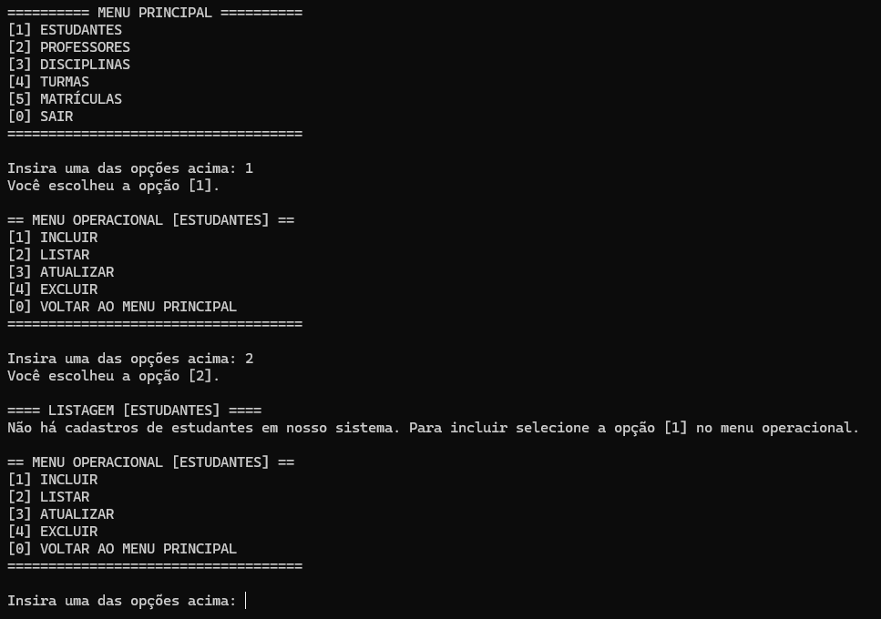

# 🐍 CRUD em Python com JSON  

Projeto desenvolvido durante o curso de Análise e Desenvolvimento de Sistemas (PUCPR).  
O sistema realiza operações de **CRUD (Create, Read, Update, Delete)** para gerenciamento acadêmico.  

## 🎯 Objetivo  
Simular um sistema de gerenciamento de alunos, professores, turmas, disciplinas e matrículas,  
utilizando **arquivos JSON** como forma de persistência de dados.  

## 🛠️ Tecnologias Utilizadas  
- Python 3  
- JSON (armazenamento de dados)  
- PyCharm (IDE utilizada no desenvolvimento)  

## 📂 Estrutura do Projeto  
    crud-python-json/

        └── main.py

        └── README.md

        └── imagens/

            └── preview.png

## 🚀 Como executar  
1. Clone este repositório:  
   ```bash
   git clone https://github.com/seuusuario/crud-python-json.git
Abra o projeto no PyCharm (ou outro editor Python).

Execute o arquivo main.py.

⚠️ Os arquivos .json de dados serão criados automaticamente quando o sistema for utilizado.

📸 Preview
